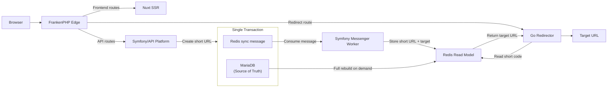

# Shawdy

[**Wechsel zur englischen version**](README.md)

Shawdy ist ein Open-Source-URL-Shortener, der als Full-Stack-Engineering- und
WIP Lernprojekt entwickelt wird.

Die Anwendung selbst ist bewusst einfach gehalten: eine lange URL entgegennehmen,
einen Short Code erzeugen und Besucher auf das ursprüngliche Ziel weiterleiten.
Der größere Schwerpunkt des Projekts liegt auf dem Engineering rund um diesen
Ablauf. Shawdy beschäftigt sich mit moderner Backend- und Frontend-Entwicklung,
Service-Grenzen, asynchroner Verarbeitung, containerisierten Umgebungen,
automatisierten Tests, CI/CD, der Trennung von Infrastruktur und Anwendung sowie
dokumentierten Architekturentscheidungen.

**Live-Anwendung:** [https://shawdy.de](https://shawdy.de)

## Architektur

Shawdy ist als Monorepo organisiert und enthält drei Anwendungskomponenten mit
separaten Laufzeitumgebungen:

- ein Symfony-/API-Platform-Backend für Anwendungslogik und Persistenz
- ein Nuxt-SSR-Frontend für die öffentliche Webanwendung
- einen kleinen Go-Service, der ausschließlich Redirects auflöst

FrankenPHP bildet den öffentlichen Entry-Point und leitet Requests an den
jeweils zuständigen Application-Service weiter.



MariaDB ist die maßgebliche Datenquelle für Short URLs. Redirect-Lookups
verwenden ein abgeleitetes Redis Read Model, anstatt MariaDB direkt abzufragen.
Änderungen werden asynchron über Symfony Messenger mit einem
Doctrine-basierten Transport weitergegeben, wobei die Message in derselben
Datenbanktransaktion wie die Anwendungsänderung geschrieben wird. Die
Redis-Projektion kann bei Bedarf vollständig aus MariaDB neu aufgebaut werden.

Der Redirect-Pfad bleibt dadurch unabhängig vom Symfony-Request-Pfad:

```text
/{shortCode}
    -> Caddy
    -> Go Redirector
    -> Redis
    -> HTTP 302
```

Diese zusätzliche Service-Aufteilung ist für das aktuelle Traffic-Volumen von
Shawdy nicht erforderlich. Sie ist eine bewusste Architektur- und
Lernentscheidung, die einen realen Anwendungsfall für Service-Grenzen, Go,
Redis Read Models, asynchrone Verarbeitung, Eventual Consistency und
eigenständige Observability schafft, ohne zu behaupten, dass eine einfachere
Symfony-only-Lösung unzureichend wäre.

Die Begründung und die Trade-offs hinter diesem Design sind in
[ADR-0011](docs/decisions/ADR-0011-redirect-service-architecture.md)
dokumentiert.

## Services

| Service | Technologie | Verantwortung |
| --- | --- | --- |
| `frankenphp` | FrankenPHP (Caddy) | Öffentlicher Entry-Point, TLS-Terminierung, Routing, Rate Limiting, Symfony-Runtime und Health-Endpunkt |
| `node` | Nuxt 4 | Server-side gerendertes Frontend und Content-Seiten |
| `messenger-worker` | Symfony Messenger | Asynchrone Application-Events, Redis-Synchronisierung und Verarbeitung transaktionaler E-Mails |
| `redirector` | Go | Löst Short Codes aus Redis auf und liefert Redirects; stellt Health- und Prometheus-Metriken bereit |
| `db` | MariaDB | Maßgebliche Anwendungsdaten und Doctrine-Messenger-Transport |
| `redis` | Redis | Abgeleitete, leseoptimierte Projektion von Short Code zu Ziel-URL |
| `mailpit` | Mailpit | Lokale Kontrolle von E-Mails während der Entwicklung |
| `playwright` | Playwright | Browserbasierte End-to-End-Tests; über das Test-Profil aktiviert |

In Production werden transaktionale E-Mails über den konfigurierten Symfony
Mailer Transport versendet und nicht über Mailpit.

## Request-Routing

FrankenPHP hält die öffentlichen Routing-Regeln explizit:

| Request | Ziel |
| --- | --- |
| `/` und Application-/Content-Routen | Nuxt |
| `/api` und `/api/*` | Symfony/API Platform |
| `/healthz` | Symfony-Health-Endpunkt |
| `/{shortCode}` | Go Redirector |
| Statische Symfony-Assets | FrankenPHP/Caddy File Server |
| Unbekannte verschachtelte Routen | Benutzerdefiniertes HTTP-Error-Handling |

Die API stellt aktuell schreiborientierte Endpunkte zum Erstellen von Short
URLs und zum Melden von Missbrauch bereit. Öffentliche API-Requests werden am
Edge und, wo sinnvoll, zusätzlich auf Anwendungsebene rate-limitiert.

## Lokale Entwicklung

### Voraussetzungen

Für die lokale Umgebung werden nur folgende Komponenten benötigt:

- Docker Engine
- Docker Compose

Application-Runtimes und Package Manager laufen innerhalb von Containern.

### Entwicklungsumgebung starten

Repository klonen und den Stack starten:

```bash
git clone https://github.com/fkdiy/shawdy.git
cd shawdy
docker compose up -d --build
```

Die Standardkonfiguration für die Entwicklung ist bewusst so ausgelegt, dass
sie ohne eine `.env`-Datei funktioniert.

Um die Konfiguration explizit zu machen oder Defaults zu überschreiben, kann
zuerst die Beispielkonfiguration kopiert werden:

```bash
cp .env.example .env
docker compose up -d --build
```

Die Development-Entrypoints installieren fehlende Abhängigkeiten, führen
Datenbankmigrationen aus, bereiten die Testdatenbank vor, kompilieren
Symfony-Assets und initialisieren bei Bedarf das Redis Redirect Read Model.

### Lokale Endpunkte

| Endpunkt | Zweck |
| --- | --- |
| [http://localhost](http://localhost) | Shawdy-Webanwendung |
| [http://localhost/api](http://localhost/api) | API-Platform-Endpunkt |
| [http://localhost/healthz](http://localhost/healthz) | Symfony-Health-Endpunkt |
| [http://localhost:8025](http://localhost:8025) | Mailpit-Weboberfläche |

### Nützliche Docker-Befehle

Laufende Services anzeigen:

```bash
docker compose ps
```

Application-Logs verfolgen:

```bash
docker compose logs -f
```

Einen Symfony-Befehl ausführen:

```bash
docker compose exec frankenphp php bin/console <command>
```

Backend-Test-Suite ausführen:

```bash
docker compose exec frankenphp vendor/bin/phpunit
```

Frontend-Unit-Tests ausführen:

```bash
docker compose exec node pnpm test:run
```

Browser-Test-Container ausführen:

```bash
docker compose --profile test run --rm playwright
```

Stack stoppen:

```bash
docker compose down
```

Um zusätzlich die lokale Datenbank und andere Named Volumes zu entfernen:

```bash
docker compose down -v
```

Der letzte Befehl entfernt lokal persistierte Daten und sollte daher nur
verwendet werden, wenn ein vollständiger Reset beabsichtigt ist.

## Konfiguration

Lokale Defaults sind in `compose.yaml` definiert. `.env.example` dokumentiert
die Umgebungsvariablen, die überschrieben werden können.

| Variable | Zweck |
| --- | --- |
| `SERVER_NAME` | Öffentlicher Caddy-Servername, zum Beispiel `http://localhost` oder `https://shawdy.de` |
| `DEFAULT_URI` | Basis-URI, die das Backend beim Erzeugen absoluter URLs verwendet |
| `DATABASE_NAME` | Name der MariaDB-Datenbank |
| `DATABASE_USER` | MariaDB-Application-User |
| `DATABASE_PASSWORD` | Passwort des MariaDB-Application-Users |
| `DATABASE_ROOT_PASSWORD` | MariaDB-Root-Passwort für den Container |
| `APP_SECRET` | Symfony-Application-Secret |
| `MAILER_DSN` | Symfony-Mailer-Transport |
| `CORS_ALLOW_ORIGIN` | Erlaubte Browser-Origins für die API |
| `MAIL_FROM` | Absenderadresse für transaktionale E-Mails |
| `ABUSE_REPORT_RECIPIENT` | Interner Empfänger für Missbrauchsmeldungen |

`SHAWDY_VERSION` ist Release-Metadaten und keine dauerhafte
Anwendungskonfiguration. Die lokale Entwicklung verwendet einen
Development-Fallback. In Production stellt der Deployment-Workflow beim
Deployment den Release-Tag bereit und persistiert den letzten erfolgreichen
Release separat.

Production-Secrets werden weder ins Repository committed noch in
Container-Images eingebettet.

## Tests und Quality Gates

Continuous Integration ist nach Verantwortungsbereichen aufgeteilt und nutzt
Path-Filter, damit nicht betroffene Teile des Monorepos keine unnötigen Jobs
ausführen.

### Backend

Der PHP-Workflow läuft gegen MariaDB und Redis und umfasst:

- Installation der Composer-Abhängigkeiten und Security Audit
- PHP CS Fixer im Dry-Run-Modus
- Validierung des Symfony-Containers
- statische Analyse mit PHPStan
- Validierung der Doctrine-Mappings
- Vorbereitung der Testdatenbank
- PHPUnit-Tests

### Frontend

Der Frontend-Workflow umfasst:

- Installation der pnpm-Abhängigkeiten und Audit
- ESLint
- Nuxt-Type-Checking
- Unit- und Component-Tests mit Vitest
- einen Production-Build von Nuxt
- End-to-End-Tests mit Playwright

Der Playwright-Job baut und startet vor den Browser-Tests den vollständigen
Shawdy-Application-Stack in Docker. Dadurch wird die Integration zwischen
Nuxt, Symfony, Messenger, MariaDB, Redis, Caddy/FrankenPHP und dem
Go-Redirector geprüft, anstatt das Frontend gegen gemockte Application-Services
zu testen.

### Redirector

Der Go-Workflow umfasst:

- Prüfung mit `gofmt`
- `go vet`
- Go-Tests gegen Redis

### Repository-weite Checks

Weitere Workflows prüfen:

- Dockerfiles mit Hadolint
- GitHub-Actions-Workflows mit actionlint
- Markdown mit markdownlint
- Dokumentationslinks mit Lychee

## Production-Container

Development und Production verwenden unterschiedliche Docker-Build-Stages.

Production-Images enthalten nur die Runtime-Abhängigkeiten, die von der
jeweiligen Anwendung benötigt werden. Die Production-Application-Container
laufen als Non-Root-User und sind, soweit sinnvoll, mit Read-only-Root-
Dateisystemen, entfernten Linux-Capabilities und `no-new-privileges`
gehärtet.

Persistente Daten werden in dedizierten Docker-Volumes für MariaDB, Redis und
den Caddy-State gespeichert. Die Application-Container selbst werden als
austauschbare Release-Artefakte behandelt.

`compose.production.yaml` enthält die Production-Runtime-Topologie und
referenziert ausschließlich versionierte Registry-Images.
`compose.production.build.yaml` ergänzt Build-Definitionen für die lokale
Validierung derselben Production-Stages; der Production-Server baut keine
Application-Images.

Ein lokaler Build der Production-Stages kann so getestet werden:

```bash
SHAWDY_VERSION=local docker compose   -f compose.production.yaml   -f compose.production.build.yaml   up -d --build
```

Production erwartet zusätzlich das externe Monitoring-Netzwerk, das durch die
Server-Infrastruktur provisioniert wird.

## CI/CD und Releases

Die Entwicklung folgt einem Issue-getriebenen Workflow:

```text
Issue
  -> Branch
  -> Implementierung / ADR
  -> Pull Request
  -> CI
  -> Rebase and merge
  -> main
```

Ein Merge nach `main` deployt Production **nicht** automatisch.

Ein Production-Release wird explizit durch das Pushen eines semantischen
Version-Tags erzeugt, zum Beispiel:

```bash
git tag v0.1.0
git push origin v0.1.0
```

Der tag-getriggerte Deployment-Workflow führt anschließend folgende Schritte
aus:

```text
Release-Tag und Zugehörigkeit zu main validieren
        |
        v
Backend-, Frontend- und Redirector-Images bauen
        |
        v
versionierte Images nach GHCR pushen
        |
        v
über den dedizierten Deploy-Account mit dem VPS verbinden
        |
        v
Production-Compose-Konfiguration hochladen
        |
        v
Release-Images pullen
        |
        v
MariaDB und Redis starten
        |
        v
Doctrine-Migrationen ausführen
        |
        v
Redis Read Model bei Bedarf initialisieren
        |
        v
vollständigen Application-Stack starten und Healthchecks abwarten
        |
        v
öffentliche Backend- und Frontend-Smoke-Tests ausführen
        |
        v
erfolgreich deployte Release-Version persistieren
```

Release-Images werden in der GitHub Container Registry versioniert:

```text
ghcr.io/fkdiy/shawdy-backend:vX.Y.Z
ghcr.io/fkdiy/shawdy-frontend:vX.Y.Z
ghcr.io/fkdiy/shawdy-redirector:vX.Y.Z
```

Das Backend-Image wird gemeinsam vom FrankenPHP-Webprozess und vom
Messenger-Worker verwendet.

Datenbankmigrationen und die Initialisierung des Read Models sind explizite
Deployment-Schritte. Sie werden bewusst nicht in Production-Container-
Entrypoints versteckt.

Die vollständige Begründung für die Deployment-Strategie ist in
[ADR-0013](docs/decisions/ADR-0013-production-deployment-strategy.md)
dokumentiert.

## Infrastruktur und Betrieb

Application-Deployment und Server-Provisionierung haben getrennte
Lebenszyklen.

Der Production-VPS wird unabhängig mit Ansible provisioniert. Host-seitige
Verantwortlichkeiten wie User- und SSH-Konfiguration, Firewalling, Docker,
fail2ban, persistente Production-Environment-Konfiguration und Monitoring
liegen außerhalb regulärer Application-Releases.

Prometheus und Grafana übernehmen das Infrastruktur-Monitoring, während der
Go-Redirector anwendungsspezifische Prometheus-Counter für Redirect-Requests,
Misses und Redis-Fehler bereitstellt.

Diese Trennung hält das Shawdy-Repository auf Application-Code und
Release-Orchestrierung fokussiert und verhindert Infrastrukturänderungen bei
regulären Application-Deployments.

## Repository-Struktur

```text
.
├── apps/
│   ├── backend/              # Symfony / API Platform
│   ├── frontend/             # Nuxt-SSR-Anwendung
│   └── redirector/           # Go-Redirect-Service
├── docker/
│   ├── frankenphp/           # PHP-Image, Caddy-Konfiguration und Error Pages
│   ├── mariadb/              # Lokale Datenbankinitialisierung
│   ├── node/                 # Nuxt-Container-Image
│   └── redirector/           # Go-Container-Image
├── docs/
│   ├── decisions/            # Architecture Decision Records
│   ├── development-workflow.md
│   ├── git.md
│   └── philosophy.md
├── .github/
│   └── workflows/            # CI- und Production-Deployment-Workflows
├── compose.yaml              # Lokale Entwicklung
├── compose.ci.yaml           # Full-Stack-CI-/E2E-Umgebung
├── compose.production.yaml   # Production-Runtime-Topologie
└── compose.production.build.yaml
                               # Lokale Production-Stage-Builds
```

Die Monorepo-Struktur und die Gründe für diese Entscheidung sind in
[ADR-0012](docs/decisions/ADR-0012-repository-structure-reevaluation.md)
dokumentiert.

## Architekturentscheidungen

Wichtige technische Entscheidungen werden als Architecture Decision Records
dokumentiert, anstatt implizit im Code zu bleiben.

Einige sinnvolle Einstiegspunkte sind:

- [ADR-0007 – Short Code Generation](docs/decisions/ADR-0007-short-code-generation.md)
- [ADR-0010 – Evaluate Nuxt SSR](docs/decisions/ADR-0010-evaluate-nuxt-ssr.md)
- [ADR-0011 – Redirect Service Architecture](docs/decisions/ADR-0011-redirect-service-architecture.md)
- [ADR-0012 – Reevaluate Repository Structure](docs/decisions/ADR-0012-repository-structure-reevaluation.md)
- [ADR-0013 – Define Production Deployment Strategy](docs/decisions/ADR-0013-production-deployment-strategy.md)

Die übergeordneten Engineering-Prinzipien hinter diesen Entscheidungen sind in
[Project Philosophy](docs/philosophy.md) beschrieben. Das Repository
dokumentiert außerdem den
[Development Workflow](docs/development-workflow.md) und den
[Git Workflow](docs/git.md).

## Projektziele

Shawdy ist sowohl eine funktionierende Anwendung als auch ein Lernprojekt.
Das Ziel besteht nicht darin, möglichst viele Technologien einzusetzen,
sondern zu zeigen, wie ein kleines Produkt mit bewusst gewählten
Engineering-Praktiken entwickelt und betrieben werden kann.

Das Projekt bevorzugt daher explizite Trade-offs, reproduzierbare Umgebungen,
automatisierte Verifikation, dokumentierte Entscheidungen, klare
Service-Verantwortlichkeiten und inkrementelle Entwicklung gegenüber
unnötiger Abstraktion.

## Lizenz

Shawdy wird unter der [MIT-Lizenz](LICENSE) veröffentlicht.
