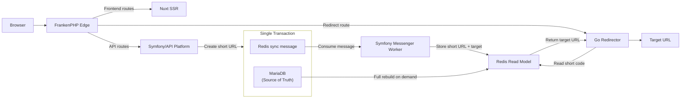

# Shawdy

[**Switch to German version**](README.de.md)

Shawdy is an open-source URL shortener built as a full-stack engineering and
WIP learning project.

The application itself is intentionally simple: accept a long URL, create a
short code, and redirect visitors to the original target. The engineering
around that flow is the larger focus of the project. Shawdy explores modern
backend and frontend development, service boundaries, asynchronous processing,
containerized environments, automated testing, CI/CD, infrastructure
separation, and documented architectural decision-making.

**Live application:** [https://shawdy.de](https://shawdy.de)

## Architecture

Shawdy is organized as a monorepo containing three application components with
separate runtimes:

- a Symfony / API Platform backend for application logic and persistence
- a Nuxt SSR frontend for the public web application
- a small Go service dedicated to redirect resolution

FrankenPHP acts as the public edge and routes requests to the appropriate
application service.



MariaDB is the authoritative data store for short URLs. Redirect lookups use a
derived Redis read model instead of querying MariaDB directly. Changes are
propagated asynchronously through Symfony Messenger using a Doctrine-backed
transport, with the message written in the same database transaction as the
application change. The Redis projection can be rebuilt from MariaDB when
required.

The redirect path therefore remains independent of the Symfony request path:

```text
/{shortCode}
    -> Caddy
    -> Go redirector
    -> Redis
    -> HTTP 302
```

This additional service split is not required by Shawdy's current traffic
volume. It is a deliberate architectural and learning decision that provides a
real use case for service boundaries, Go, Redis read models, asynchronous
processing, eventual consistency, and independent observability without
pretending that a simpler Symfony-only implementation would be insufficient.

The reasoning and trade-offs behind this design are documented in
[ADR-0011](docs/decisions/ADR-0011-redirect-service-architecture.md).

## Services

| Service | Technology | Responsibility |
| --- | --- | --- |
| `frankenphp` | FrankenPHP (Caddy) | Public edge, TLS termination, routing, rate limiting, Symfony runtime and health endpoint |
| `node` | Nuxt 4 | Server-side rendered frontend and content pages |
| `messenger-worker` | Symfony Messenger | Asynchronous application events, Redis synchronization and transactional email processing |
| `redirector` | Go | Resolves short codes from Redis and returns redirects; exposes health and Prometheus metrics |
| `db` | MariaDB | Authoritative application data and Doctrine Messenger transport |
| `redis` | Redis | Derived, read-optimized short-code-to-target-URL projection |
| `mailpit` | Mailpit | Local email inspection during development |
| `playwright` | Playwright | Browser-based end-to-end tests; enabled through the test profile |

In production, transactional email is sent through the configured Symfony
Mailer transport rather than Mailpit.

## Request routing

FrankenPHP keeps the public routing rules explicit:

| Request | Destination |
| --- | --- |
| `/` and application/content routes | Nuxt |
| `/api` and `/api/*` | Symfony/API Platform |
| `/healthz` | Symfony health endpoint |
| `/{shortCode}` | Go redirector |
| Symfony static assets | FrankenPHP/Caddy file server |
| Unknown nested routes | Custom HTTP error handling |

The API currently exposes write-oriented endpoints for creating short URLs and
submitting abuse reports. Public API requests are rate-limited at the edge and
again at the application level where appropriate.

## Local development

### Prerequisites

The local environment only requires:

- Docker Engine
- Docker Compose

Application runtimes and package managers run inside containers.

### Start the development environment

Clone the repository and start the stack:

```bash
git clone https://github.com/fkdiy/shawdy.git
cd shawdy
docker compose up -d --build
```

The default development configuration is intentionally usable without creating
an `.env` file.

To make the configuration explicit or override defaults, copy the example
configuration first:

```bash
cp .env.example .env
docker compose up -d --build
```

The development entrypoints install missing dependencies, apply database
migrations, prepare the test database, compile Symfony assets, and initialize
the Redis redirect read model when required.

### Local endpoints

| Endpoint | Purpose |
| --- | --- |
| [http://localhost](http://localhost) | Shawdy web application |
| [http://localhost/api](http://localhost/api) | API Platform endpoint |
| [http://localhost/healthz](http://localhost/healthz) | Symfony health endpoint |
| [http://localhost:8025](http://localhost:8025) | Mailpit web interface |

### Useful Docker commands

Show the running services:

```bash
docker compose ps
```

Follow application logs:

```bash
docker compose logs -f
```

Run a Symfony command:

```bash
docker compose exec frankenphp php bin/console <command>
```

Run the backend test suite:

```bash
docker compose exec frankenphp vendor/bin/phpunit
```

Run frontend unit tests:

```bash
docker compose exec node pnpm test:run
```

Run the browser test container:

```bash
docker compose --profile test run --rm playwright
```

Stop the stack:

```bash
docker compose down
```

To also remove local database and other named volumes:

```bash
docker compose down -v
```

The latter removes local persisted data and should therefore only be used when
a full reset is intended.

## Configuration

Local defaults are defined in `compose.yaml`. `.env.example` documents the
environment variables that can be overridden.

| Variable | Purpose |
| --- | --- |
| `SERVER_NAME` | Public Caddy server name, for example `http://localhost` or `https://shawdy.de` |
| `DEFAULT_URI` | Base URI used by the backend when generating absolute URLs |
| `DATABASE_NAME` | MariaDB database name |
| `DATABASE_USER` | MariaDB application user |
| `DATABASE_PASSWORD` | MariaDB application password |
| `DATABASE_ROOT_PASSWORD` | MariaDB root password used by the container |
| `APP_SECRET` | Symfony application secret |
| `MAILER_DSN` | Symfony Mailer transport |
| `CORS_ALLOW_ORIGIN` | Allowed browser origins for the API |
| `MAIL_FROM` | Sender address for transactional email |
| `ABUSE_REPORT_RECIPIENT` | Internal recipient for abuse-report notifications |

`SHAWDY_VERSION` is release metadata rather than durable application
configuration. Local development falls back to a development version. In
production, the deployment workflow supplies the release tag while deploying
and persists the last successful release separately.

Production secrets are not committed to the repository and are not embedded in
container images.

## Testing and quality gates

Continuous integration is split by responsibility and uses path filters so
unrelated parts of the monorepo do not run unnecessary jobs.

### Backend

The PHP workflow runs against MariaDB and Redis and includes:

- Composer dependency installation and security audit
- PHP CS Fixer in dry-run mode
- Symfony container validation
- PHPStan static analysis
- Doctrine mapping validation
- test database preparation
- PHPUnit tests

### Frontend

The frontend workflow includes:

- pnpm dependency installation and audit
- ESLint
- Nuxt type checking
- Vitest unit and component tests
- a production Nuxt build
- Playwright end-to-end tests

The Playwright job builds and starts the complete Shawdy application stack in
Docker before running browser tests. This verifies integration across Nuxt,
Symfony, Messenger, MariaDB, Redis, Caddy/FrankenPHP, and the Go redirector
rather than testing the frontend against mocked application services.

### Redirector

The Go workflow includes:

- `gofmt` verification
- `go vet`
- Go tests against Redis

### Repository-level checks

Additional workflows validate:

- Dockerfiles with Hadolint
- GitHub Actions workflows with actionlint
- Markdown with markdownlint
- documentation links with Lychee

## Production containers

Development and production use different Docker build stages.

Production images contain only the runtime dependencies required by the
respective application. The production application containers run as non-root
users and are hardened with read-only root filesystems where practical,
dropped Linux capabilities, and `no-new-privileges`.

Persistent data is kept in dedicated Docker volumes for MariaDB, Redis, and
Caddy state. Application containers themselves are treated as disposable
release artifacts.

`compose.production.yaml` contains the production runtime topology and refers
only to versioned registry images. `compose.production.build.yaml` adds build
definitions for local validation of the same production stages; the production
server does not build application images.

A local production-stage build can be tested with:

```bash
SHAWDY_VERSION=local \
docker compose \
  -f compose.production.yaml \
  -f compose.production.build.yaml \
  up -d --build
```

Production additionally expects the external monitoring network provisioned by
the server infrastructure.

## CI/CD and releases

Development work follows an issue-driven workflow:

```text
Issue
  -> Branch
  -> Implementation / ADR
  -> Pull Request
  -> CI
  -> Rebase and merge
  -> main
```

Merging into `main` does **not** automatically deploy production.

A production release is created explicitly by pushing a semantic version tag,
for example:

```bash
git tag v0.1.0
git push origin v0.1.0
```

The tag-triggered deployment workflow then:

```text
validate release tag and main ancestry
        |
        v
build backend, frontend and redirector images
        |
        v
push versioned images to GHCR
        |
        v
connect to the VPS through the dedicated deploy account
        |
        v
upload the production Compose configuration
        |
        v
pull the release images
        |
        v
start MariaDB and Redis
        |
        v
run Doctrine migrations
        |
        v
initialize the Redis read model if required
        |
        v
start the complete application stack and wait for health checks
        |
        v
run public backend and frontend smoke tests
        |
        v
persist the successfully deployed release version
```

Release images are versioned in GitHub Container Registry:

```text
ghcr.io/fkdiy/shawdy-backend:vX.Y.Z
ghcr.io/fkdiy/shawdy-frontend:vX.Y.Z
ghcr.io/fkdiy/shawdy-redirector:vX.Y.Z
```

The backend image is shared by the FrankenPHP web process and the Messenger
worker.

Database migrations and read-model initialization are explicit deployment
operations. They are intentionally not hidden in production container
entrypoints.

The complete deployment rationale is documented in
[ADR-0013](docs/decisions/ADR-0013-production-deployment-strategy.md).

## Infrastructure and operations

Application deployment and server provisioning have separate lifecycles.

The production VPS is provisioned independently with Ansible. Host-level
responsibilities such as user and SSH configuration, firewalling, Docker,
fail2ban, persistent production environment configuration, and monitoring are
kept outside regular application releases.

Prometheus and Grafana provide infrastructure monitoring, while the Go
redirector exposes application-specific Prometheus counters for redirect
requests, misses, and Redis errors.

This separation keeps the Shawdy repository focused on application code and
release orchestration while avoiding infrastructure changes during normal
application deployments.

## Repository structure

```text
.
├── apps/
│   ├── backend/              # Symfony / API Platform
│   ├── frontend/             # Nuxt SSR application
│   └── redirector/           # Go redirect service
├── docker/
│   ├── frankenphp/           # PHP image, Caddy configuration and error pages
│   ├── mariadb/              # Local database initialization
│   ├── node/                 # Nuxt container image
│   └── redirector/           # Go container image
├── docs/
│   ├── decisions/            # Architecture Decision Records
│   ├── development-workflow.md
│   ├── git.md
│   └── philosophy.md
├── .github/
│   └── workflows/            # CI and production deployment workflows
├── compose.yaml              # Local development
├── compose.ci.yaml           # Full-stack CI / E2E environment
├── compose.production.yaml   # Production runtime topology
└── compose.production.build.yaml
                               # Local production-stage builds
```

The monorepo structure and the reasons for choosing it are documented in
[ADR-0012](docs/decisions/ADR-0012-repository-structure-reevaluation.md).

## Architectural decisions

Important technical decisions are documented as Architecture Decision Records
instead of being left implicit in the codebase.

A few useful starting points are:

- [ADR-0007 – Short Code Generation](docs/decisions/ADR-0007-short-code-generation.md)
- [ADR-0010 – Evaluate Nuxt SSR](docs/decisions/ADR-0010-evaluate-nuxt-ssr.md)
- [ADR-0011 – Redirect Service Architecture](docs/decisions/ADR-0011-redirect-service-architecture.md)
- [ADR-0012 – Reevaluate Repository Structure](docs/decisions/ADR-0012-repository-structure-reevaluation.md)
- [ADR-0013 – Define Production Deployment Strategy](docs/decisions/ADR-0013-production-deployment-strategy.md)

The broader engineering principles behind these decisions are described in
[Project Philosophy](docs/philosophy.md). The repository also documents its
[development workflow](docs/development-workflow.md) and
[Git workflow](docs/git.md).

## Project goals

Shawdy is both a working application and a learning project. The goal is not
to maximize the number of technologies involved, but to demonstrate how a
small product can be developed and operated with deliberate engineering
practices.

The project therefore favors explicit trade-offs, reproducible environments,
automated verification, documented decisions, clear service ownership, and
incremental development over unnecessary abstraction.

## License

Shawdy is released under the [MIT License](LICENSE).
